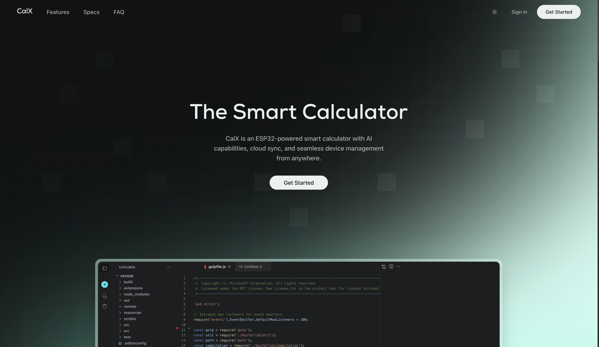

# CalX Dashboard

<div align="center">

[](https://calxio.vercel.app/)
[](https://nextjs.org/)
[](https://www.typescriptlang.org/)
[](LICENSE)

**The web dashboard for managing your CalX smart calculator device.**

🌐 **[CalX Website](https://calxio.vercel.app/)**



</div>

---

## Features

- **User Authentication** - Secure login/register with JWT
- **Device Binding** - Connect your CalX device using a 4-character code
- **Device Overview** - Monitor battery, status, and firmware version
- **AI Configuration** - Set up your preferred AI provider (OpenAI, Anthropic, Gemini, etc.)
- **Real-time Chat** - Send messages to your device
- **File Storage** - Upload and sync text files to your device
- **Device Settings** - Configure power mode, text size, keyboard layout
- **OTA Updates** - Trigger firmware updates

## Tech Stack

- **Framework**: Next.js 15
- **Styling**: Tailwind CSS
- **UI Components**: Radix UI + shadcn/ui
- **Forms**: React Hook Form + Zod
- **Backend**: [CalX Backend](https://github.com/Saijayaranjan/calx-backend)

## Getting Started

```bash
# Install dependencies
npm install

# Configure environment (optional - defaults to production backend)
echo "NEXT_PUBLIC_API_URL=https://calx-backend.onrender.com" > .env.local

# Run development server
npm run dev
```

Open [http://localhost:3000](http://localhost:3000)

## Environment Variables

| Variable | Default | Description |
|----------|---------|-------------|
| `NEXT_PUBLIC_API_URL` | `https://calx-backend.onrender.com` | Backend API URL |

## Deployment

### Vercel (Recommended)

1. Connect your GitHub repo to Vercel
2. Deploy - it works out of the box!

### Manual

```bash
npm run build
npm start
```

## ✅ What Works Today

- User registration and login with JWT authentication
- Device binding via 4-character codes
- Multi-provider AI configuration (OpenAI, Gemini, Claude, etc.)
- Real-time chat between dashboard and device
- File storage and sync (up to 4000 characters)
- Device settings management
- Responsive dashboard UI

## ⚠️ Known Issues

- **No rate limiting** - API endpoints don't have rate limiting yet
- **Device page requires hardware** - Device features need a physical CalX device
- **OTA not tested end-to-end** - Firmware updates implemented but not fully tested

## License

Apache License 2.0 - see [LICENSE](LICENSE) for details.

---

<div align="center">

**Part of the CalX Ecosystem**

🌐 [CalX Website](https://calxio.vercel.app/) • [Backend](https://github.com/Saijayaranjan/calx-backend) • [Firmware](https://github.com/Saijayaranjan/CalX-Fireware)

</div>
